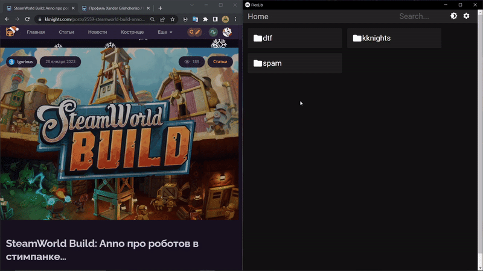

# electronFlexLib
electronFlexLib - простое настольное приложения для сохранения веб-статей на устройство для дальнейшего использования.
### Версия:  0.1
**Возможности:** с помощью EFL вы можете скачивать статьи с сайтов, API которых поддерживает приложение.
Приложение скачивает не только текст, но и содержимое медиа. Исключая вставки (например видео youtube, треки Spotify, страницы Steam),
доступ к ним будет возможен только при подключении к интернету.  
Благодаря EFL вы можете без проблем хранить скачанные статьи на жёстком диске и читать их в удобном месте без интернета.
### Поддержка сайтов:
**✓ kknights.com**  
**× DTF** (in progress)
### Скачать:
**✓ Linux: [.deb](https://github.com/AllexKzk/electron-flex-lib/raw/main/builds/deb/electronflexlib_0.5_amd64.deb)**  
**✓ Windows: [.exe](https://github.com/AllexKzk/electron-flex-lib/raw/main/builds/exe/electronflexlib-0.5.0%20Setup.exe)**
### Roadmap:
**✓ Добавить exe билд**  
**× Добавить поддержку DTF**  
**× Доработка ошибок, добавление новых компонентов**  
**× Добавить настройки палитры и размера шрифта**  
====================Версия 0.5==================

