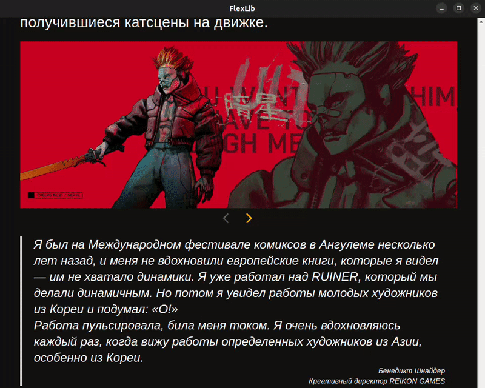

# electronFlexLib
electronFlexLib - простое настольное приложения для сохранения веб-статей на устройство для дальнейшего использования.
## Версия:  0.6
**Возможности:** с помощью EFL вы можете скачивать статьи с сайтов, API которых поддерживает приложение.
Приложение скачивает не только текст, но и содержимое медиа, исключая вставки (например видео youtube, треки Spotify, страницы Steam):
доступ к ним будет возможен только при подключении к интернету.  
Благодаря EFL вы можете без проблем хранить скачанные статьи на жёстком диске и читать их в удобном месте без интернета.
### Поддержка сайтов:
**✓ kknights.com**  
**✓ DTF**\
**✓ VC**
### Скачать:
**✓ Linux: [.deb](https://github.com/AllexKzk/electron-flex-lib/releases/download/v0.5/electronflexlib_0.5.0_amd64.deb), [.rpm](https://github.com/AllexKzk/electron-flex-lib/releases/download/v0.5/electronflexlib-0.5.0-1.x86_64.rpm)**   
**✓ Windows: [.exe](https://github.com/AllexKzk/electron-flex-lib/releases/download/v0.5/electronflexlib-0.5.0.Setup.exe)**
## Roadmap:
====================Версия 0.5================== \
**✓ Добавить exe билд**  
**✓ Добавить поддержку DTF**  
**✓ Обработка ошибок**  
**✓ Добавить настройки размера шрифта**  
====================Версия 0.6================== \
**✓ Поддержка Osnova-API v2.1**  
**✓ Расширение настроек**
- ✓ Отключение скачивания медиа контента (видео, аудио)
- ✓ Настройка пути сохранения медиа
- ✓ Настройка шрифта

**✓ Исправление багов v0.5** 
- ✓ Исправить раскрытие папки с исходниками (windows)
- ✓ Исправить отображение шрифтов

**✓ Небольшие визуальные изменения**

====================Версия 0.7================== \
**× Исправление критических ошибок**
- × Исправления якорей OSNOVA API
- × Ошибки загрузки медиа
- × Переписывание роутинга

**× Поддержка скачивания всех статей из избранного** \
**× Настройка цветовой палитры** \
**× Сохранение в формате PDF/djvu** \
====================Версия 0.8================== \
**× Добавление базы данных статей** \
**× Реализация поиска по фильтрам(тегам)**
## Демонстрация функционала:
**Скачивание постов:**

**Изменение размера шрифта:**

**Смена темы и папка с исходниками:**

